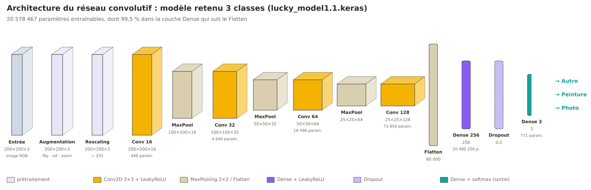
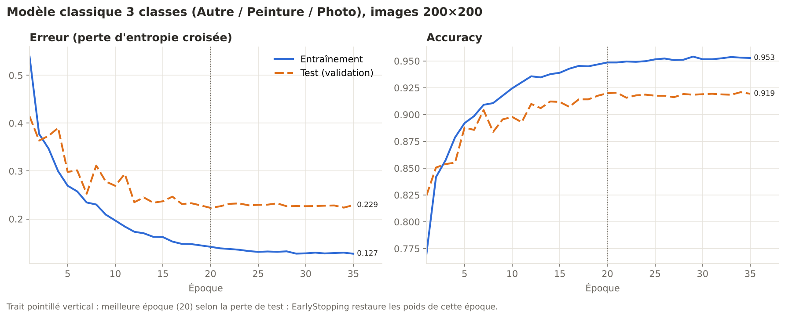
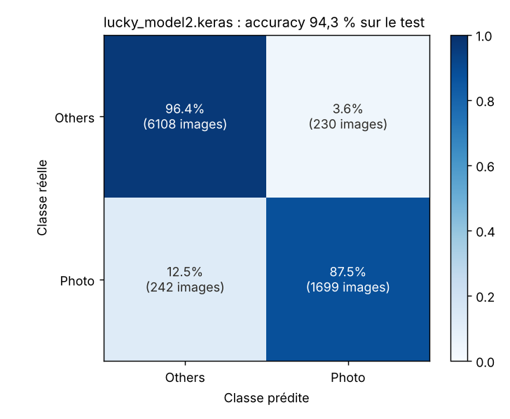

# Projet Leyenda

Réseaux de neurones convolutifs (TensorFlow / Keras) qui reconnaissent le **type d'une image** : **photo**,
**peinture** ou **autre**, et un site web local pour les tester dans le navigateur.

**Groupe** : Isrâ Boudemagh · Théophile Noel · Bruno Rieckenberg · Corentin Romano

## Modèles retenus

On garde le meilleur modèle de chaque notebook. Ce sont les deux seuls modèles testables sur le site.

| Fichier | Notebook | Classes | Accuracy test | Nom sur le site |
|---|---|---|---|---|
| `lucky_model2.keras` | `Livrable1/L1.ipynb` | Others / Photo | 94,3 % | `model_photo_autre` |
| `lucky_model1.1.keras` | `Livrable1/L1,1.ipynb` | Others / Painting / Photo | 92,0 % | `model_photo_autre_peinture` |

Les autres essais restent dans les notebooks pour comparaison (par exemple le modèle *P2P* peinture / photo de
`L1,1.ipynb`), mais ils ne sont pas retenus.

## Organisation

```
projet/
├── Livrable1/      notebooks L1 (2 classes) et L1,1 (3 classes), dataset (non versionné)
├── Test_photos/    12 images de test choisies à la main
├── Test_website/   site de test local (index.html) et modèles exportés
└── docs/           figures de ce README
```

Chaque notebook explique en détail l'architecture, la perte, l'optimiseur, les courbes, l'analyse biais / variance
et les pistes d'amélioration.

## Données

* 41 399 images, un dossier par classe (le nom du dossier sert d'étiquette).
* Nettoyage des images illisibles, puis découpage **80 % entraînement / 20 % test** (`seed=42`).
* Images redimensionnées en **200×200**, batchs de **128**.
* **Augmentation** : miroir horizontal, rotation ± 36°, zoom ± 20 % (pas de changement de couleur, la couleur
  aide à reconnaître une peinture).

## Architecture



* 4 blocs **Conv2D 3×3** (16, 32, 64, 128 filtres, `padding='same'`, **LeakyReLU**) séparés par du **MaxPooling 2×2**.
* **Flatten**, **Dense(256)** + LeakyReLU, **Dropout(0,2)**, puis **Dense + softmax** (une probabilité par classe).
* 20,6 millions de paramètres, dont 99,5 % dans la couche Dense après le Flatten.
* `lucky_model2.keras` est une version plus légère : 3 blocs convolutifs, Dense(128), 2 sorties.

## Entraînement

* **Perte** : entropie croisée catégorielle (`SparseCategoricalCrossentropy`), soit −log de la probabilité donnée à
  la bonne classe. Elle punit fortement les erreurs commises avec assurance.
* **Optimiseur** : **Adam**, pas initial 10⁻³. Il combine un momentum (moyenne des gradients) et un pas propre à
  chaque poids (moyenne des gradients au carré). Ce n'est pas un SVM : un SVM est un autre type de classifieur, pas
  un optimiseur.
* **Callbacks** : `ReduceLROnPlateau` (pas × 0,75 dès que la perte de test stagne, minimum 10⁻⁵) et
  `EarlyStopping` (patience 15, retour aux meilleurs poids).

## Résultats



Modèle 3 classes : meilleure époque 20, accuracy **94,9 %** à l'entraînement et **92,0 %** au test.



Modèle 2 classes : 94,3 % au test, mais 87,5 % seulement des photos reconnues, car elles ne représentent que 23 %
des images.

## Biais / variance

* **Variance modérée** : environ 3 points d'écart entre entraînement et test, puis la perte de test stagne alors
  que celle d'entraînement baisse encore. Le sur-apprentissage est contenu par l'augmentation, le dropout, la baisse
  du pas et l'early stopping.
* **Biais présent** : même à l'entraînement le réseau plafonne vers 95 % (réseau convolutif peu profond, images
  200×200, images ambiguës).
* **Limite** : le jeu de test sert aussi à choisir l'époque d'arrêt, les scores sont donc un peu optimistes.

## Pistes d'amélioration

* Remplacer `Flatten` par `GlobalAveragePooling2D` : la couche dense passerait de 20,5 M à 33 000 paramètres.
* Plus de régularisation : dropout 0,4-0,5, régularisation L2, augmentation plus variée.
* Batch Normalization, réseau plus profond ou transfer learning (MobileNet, EfficientNet) pour réduire le biais.
* Rééquilibrer les classes (`class_weight`) et garder un vrai jeu de test séparé (70 / 15 / 15).

## Site de test

Ouvrir `Test_website/index.html` (double-clic, aucun serveur nécessaire). On dépose des images et chaque modèle
donne sa réponse. Tout est calculé dans le navigateur : `convertir_modeles.py` exporte les poids des fichiers
`.keras` et vérifie que le site obtient les mêmes résultats que Keras.

Ajouter un modèle : créer un dossier dans `Test_website/modeles/`, y mettre le `.keras` (et un `classes.txt`
optionnel), lancer `convertir_modeles.bat`, puis recharger la page.

## Lancer les notebooks

```bash
pip install tensorflow matplotlib numpy pillow
jupyter lab Livrable1/
```

Les notebooks attendent le dataset dans `Livrable1/dataset/<Classe>/` et les modèles dans `models/`.
